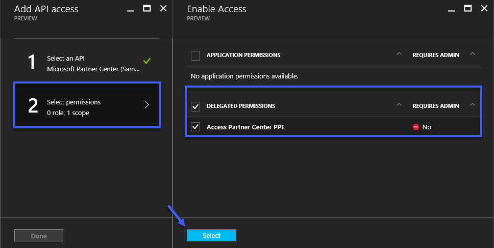

# Introduction to the Partner Center SDK

The Partner Center SDK provides a simple method for integrating with the Cloud Solution Provider (CSP) program. With this SDK you have the 
ability to perform nearily every operation that is possible through [Partner Center](https://partnercenter.microsoft.com). The purpose of
this article is introduce you to the SDK, and provide you with a base understanding of how to work with it. 

## Authentication 
Before you can perform any operation using the Partner Center SDK you must first obtain the appropriate access token. Obtaining the necessary 
access token can be somewhat tricky because some operations in the SDK require *app + user authentication*, while other operations can utilize
an access token obtained using *app only authentication*. Before you can obtain an access token you must first create, or register, an 
application in Azure Active Directory (AAD). This can be accomplished using one of the following methods

### Creating a Native Application Using the Azure Management Portal
1. Login into the [Azure Management Portal](https://portal.azure.com) using credentials associated with your CSP reseller tenant
2. Open the AAD resource management blade, then click *App registrations*, and then click *Add*

	

3. Specify an appropriate name, select *Native* for the application type, and then specify an appropriate *Redirect URI* value

	

4. Select the application once it is successfully created
5. Click *Required permissions* under *API Access* in the *Settings* blade and then click *Add*

	

6. Click *Select an API* and then search for *Sample*

	

7. Click *Select permissions,* then select the *Access Partner Center PPE* permission, and then click *Select* 

	
 
 8. Click *Done* in order to complete the addition of the API 

 9. Click on the *Windows Azure Active Directory* API permission

 10. Add the *Read directory data,* *Access the directory as the signed-in user* and then click *Save*
 	
	 

### Creating a Web Application Using the Azure Management Portal
This method utilizes the Azure AD resource management blades found in the [Azure Management Portal](https://portal.azure.com). To create 
the required application perform the following tasks

1. Login into the [Azure Management Portal](https://portal.azure.com) using credentials associated with your CSP reseller tenant
2. Open the AAD resource management blade, then click *App registrations*, and then click *Add*

	

3. Specify a name for the application, select *Web app / API* for the type, and then specify the appropriate value for the the sign-on URL

	

4. Select the application once it is successfully created
5. Click *Required permissions* under *API Access* in the *Settings* blade and then click *Add*

	

6. Click *Select an API* and then search for *Sample*

	

7. Click *Select permissions,* then select the *Access Partner Center PPE* permission, and then click *Select* 

	
 
 8. Click *Done* in order to complete the addition of the API 

 9. Click on the *Windows Azure Active Directory* API permission

 10. Add the *Read directory data,* *Access the directory as the signed-in user* and then click *Save*
 	
	 

 11. Click on *Keys* under *API Access* on the *Settings* blade

 12. Specify an appropriate description, select the desired duration, and then click *Save*
 
     	

	 Be sure to document the key value after clicking *Save.* The value will not be retrievable once you navigate away from this blade. 

13. Modify the *Reply URLs* if necessary 

	

	If you are planning on utilizing this application for authentication purposes a valid entry for the reply URLs must be specified. The Reply
	URL is the location to which Azure AD will send the authentication response, including a token if authentication was successful. You can find 
	more details [here](https://docs.microsoft.com/en-us/azure/active-directory/active-directory-authentication-scenarios). 
	

### Application Only Authentication 
If you are planning to utilize Application Only authentication when accessing the Partner Center API then you must utilize a web application. Also, 
the application must be registered in the Partner Center portal. To register the application perform the following  

1. Navigate to https://partnercenter.microsoft.com and authenticate using credentials that have *AdminAgent* privileges 
2. Click on *Account Settings* and then *App Management*
3. If you have an existing Azure AD application that you would like to utilize then click *Register existing app,* otherwise, click *Add new web app*

	

4. If you clicked *Register existing app* then select the appropriate application then click *Register your application*

	