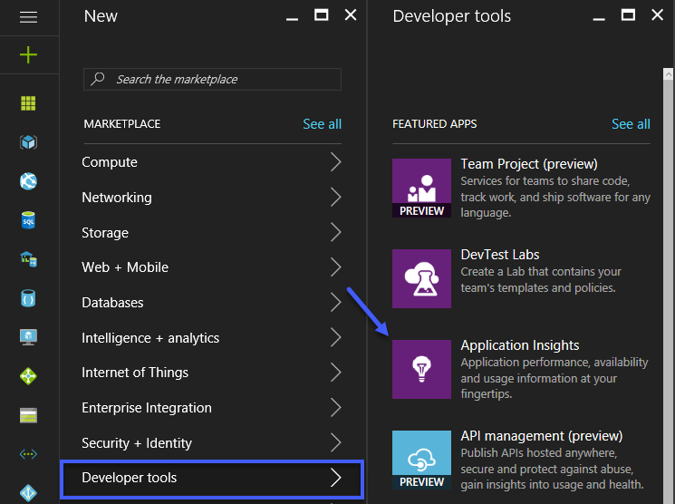
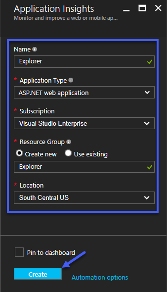
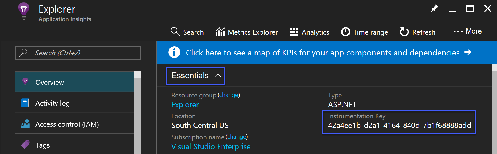
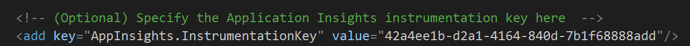
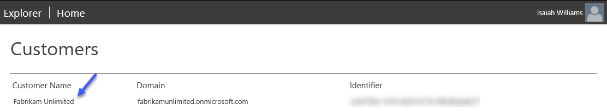
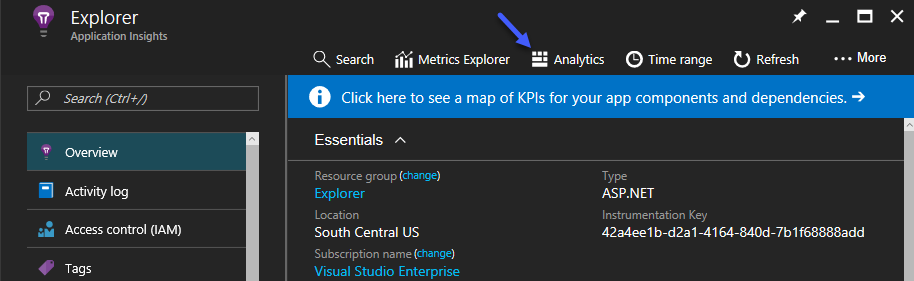
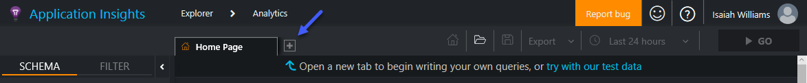
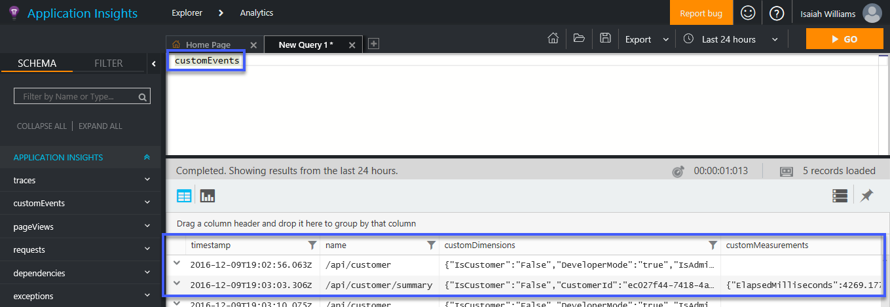

# Lab - App Insights for Partner Center Explorer
Application Insights is an extensible Application Performance Management (APM) service for web developers. It can be utilized to monitor a live web application and 
automatically detect performance anomalies. Throught this lab you will learn how to configure Application Insights for Parnter Center Explorer. 

## Prerequisites 
The following table documents all of prerequisites for this lab

| Prerequisite          | Purpose                                                                                                                             |
|-----------------------|-----------------------------------------------------------------------------------------------|
|  Azure Subscription   | Required to provision the instance of Application Insights where telemetry data will be sent. |

## Walkthrough

### Provisioning Application Insights
If you have already provisioned an instance of Application Insights then you can skip this step. To provision an instnace of Application Insights perform the following 

1. Browse to the [Azure Management portal](https://portal.azure.com) and login  

2. Click *New* -> *Developer Tools* -> *Application Insights*

    

3. Specify the appropriate information and then click *Create*

    

### Configuring Partner Center Explorer
Perform the following to configure Partner Center Explorer to send telemetry data to Application Insights

1. Obtain the *Insurmentation Key* from the [Azure Management portal](https://portal.azure.com)

    

2. Update the *AppInsights.InstrumentationKey* setting in the *web.config* file  

    
    
### Custom Telemetry Event on the Server Side
Custom telemetry events generated on the server side makes it easier to detect anomalies and issues. Also, having this information makes it possible to 
quickly diagnose execptions that occur. An example of how this is accomplished can be found in the *CustomerController.cs* file. The following code 
snippet illustrates how this is accomplished

``` csharp
[@Authorize(UserRole = UserRole.Any)]
[HttpGet]
[Route("")]
public async Task<CustomersViewModel> GetCustomersAsync()
{
    Customer customer;
    CustomerPrincipal principal;
    CustomersViewModel viewModel;
    DateTime startTime; 
    Dictionary<string, double> eventMeasurements;
    Dictionary<string, string> eventProperties;
    SeekBasedResourceCollection<Customer> customers;

    try
    {
        startTime = DateTime.Now; 

        principal = HttpContext.Current.User as CustomerPrincipal;

        viewModel = new CustomersViewModel()
        {
            Customers = new List<Customer>()
        };

        if (principal.IsAdmin)
        {
            customers = await _partner.Customers.GetAsync();
            viewModel.Customers.AddRange(customers.Items);
        }
        else
        {
            // The authenticated users is not a partner administrator. This means the
            // user is a global administrator for the customer their account is 
            // associated with. In this situation only the customer the authenticated 
            // user belongs to should be returned.
            customer = await _partner.Customers.ById(principal.CustomerId).GetAsync();
            viewModel.Customers.Add(customer);
        }

        // Capture the request for the customer summary for analysis.
        eventProperties = new Dictionary<string, string>()
        {
            { "Email", principal.Email  },
            { "IsAdmin", principal.IsAdmin.ToString() },
            { "IsCustomer", principal.IsCustomer.ToString() },
            { "PrincipalCustomerId", principal.CustomerId }
        };

        // Track the event measurements for analysis.
        eventMeasurements = new Dictionary<string, double>()
        {
            { "CustomerCount", viewModel.Customers.Count },
            {"ElapsedMilliseconds", DateTime.Now.Subtract(startTime).TotalMilliseconds }
        };

        _telemetry.TrackEvent("/api/customer", eventProperties, null);

        return viewModel;
    }
    finally
    {
        customer = null;
        customers = null;
        eventProperties = null;
        principal = null;
    }
}
```

The *TrackEvent* function call is what sends the telemetry event to Application Insights. Additional custom events can be added as needed. 

### Triggering Events
After perform the configurations documented above open Partner Center Explorer in a browser and click on a customer after the initial list 
has been loaded



### Querying Performance Data and Meterics
To query the events you can utilize the *Analytics* portal accessible from the [Azure Management portal](https://portal.azure.com). Perform the following 
to access the *Analytics* portal and execute a query 

1. Open the *Application Insights* resource in the Azure Management portal 

    
    
2. Create a new query by clicking on the *+* 

    

3. Specify an appropriate query 

    
  
The following query is another sample one that demonstrates how you can develop a complex query. 

```
customEvents
 | where timestamp >= ago(24h)
 | summarize count() by name
 | top 10 by count_
 | render barchart
```

## Resources
* [Set up alerts](https://docs.microsoft.com/en-us/azure/application-insights/app-insights-alerts) and [availability tests](https://docs.microsoft.com/en-us/azure/application-insights/app-insights-monitor-web-app-availability) to learn about issues as soon as they happen.
* [Share dashboards](https://docs.microsoft.com/en-us/azure/application-insights/app-insights-dashboards) showing charts and tables tailored to your application.
* Monitor with your own [custom events and metrics](https://docs.microsoft.com/en-us/azure/application-insights/app-insights-api-custom-events-metrics), and your existing [performance counters](https://docs.microsoft.com/en-us/azure/application-insights/app-insights-web-monitor-performance#system-performance-counters).
* [Create custom queries](https://docs.microsoft.com/en-us/azure/application-insights/app-insights-analytics-using) over your telemetry to analyze how your app is running and being used.
* Detect and diagnose abnormal rise in failure rate with [Smart Detection - Failure Anomalies](https://docs.microsoft.com/en-us/azure/application-insights/app-insights-proactive-failure-diagnostics).
* Diagnose failures and [exceptions](https://docs.microsoft.com/en-us/azure/application-insights/app-insights-asp-net-exceptions), handled or unhandled.