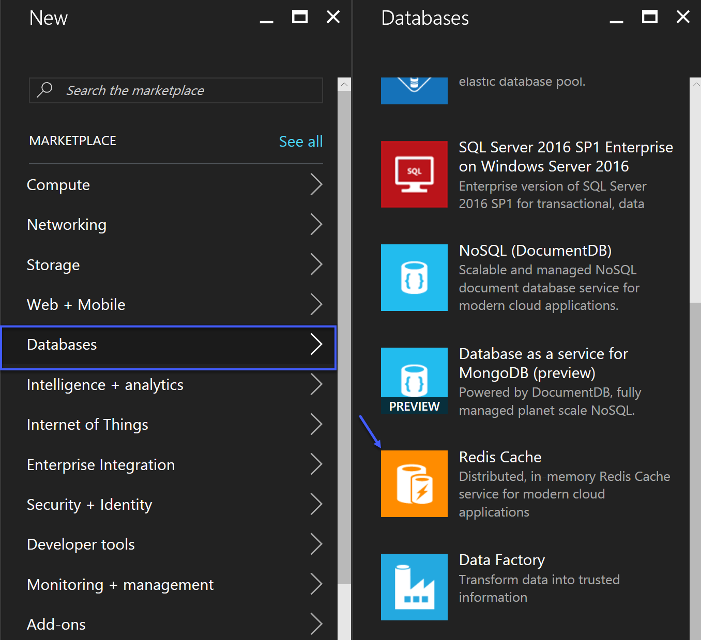
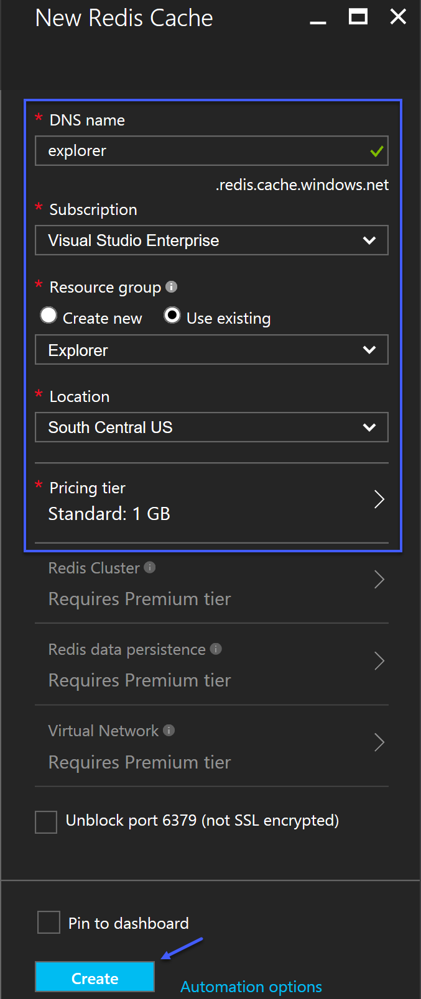
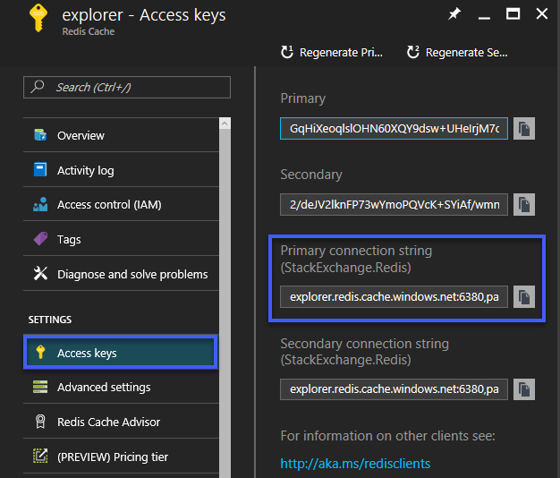
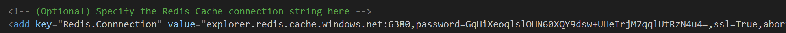

# Lab - Redis Cache for Partner Center Explorer
Azure Redis Cache is based on the popular open-source Redis cache. It gives you access to a secure, dedicated Redis cache, managed by 
Microsoft and accessible from any application within Azure. Partner Center Explorer utilizes Redis Cache to optomize the process of 
requesting an OAuth access tokens. The following section of this guide will walktrhough provisioning an instance of Redis Cache and 
the required configurations for Partner Center Explorer.

## Prerequisites 
The following table documents all of prerequisites for this lab

| Prerequisite          | Purpose                                                                                                                             |
|-----------------------|-----------------------------------------------------------------------------------------------------|
|  Azure Subscription   | Required to provision the instance of Redis Cache, that will be utilized for caching access tokens. |

## Walkthrough

### Provisioning Redis Cache
If you already have an instance of Redis Cache provisioned you can skip this step. To provision the instance of Redis Cache perform 
the following 

1. Browse to the [Azure Management portal](https://portal.azure.com) and login

2. Click *New* -> *Databases* -> *Redis Cache*

	

3. Specify the required information and click *Create*

	

### Configuring Partner Center Explorer to use Redis Cache
If the application setting *Redis.Cache* is not configured in the web.config, then the solution will utilize a builtin mechanism for
caching OAuth access tokens. This builtin approach is not the best solution when the project has been deployed to Azure, or a web farm. 
The reason behind this is that additional servers in those scenarios will not be able to take advantage of the tokens obtained through 
out use of the project. If you would like additional details then please check out [Caching access tokens in a multiteant application](https://docs.microsoft.com/en-us/azure/guidance/guidance-multitenant-identity-token-cache).

4. Obtain the connection string details from the newly created instance of Redis Cache

	

5. Populate the *Redis.Connection* application setting in the web.config file

	
	
### Leveraging the Cache
After configuring the *Redis.Connection* application setting in the *web.config* Partner Center Explorer will start utilizing the instance of Redis Cache for
caching OAuth access tokens and various data structures. The Active Directory Authentication Library (ADAL) has a built-in token caching strategy that can be extended 
by implementing a class that inherits *Microsoft.IdentityModel.Clients.ActiveDirectory.TokenCache*. The *DistributedTokenCache* class extends the caching 
strategy utilized by ADAL to leverage Redis Cache as the medium to store OAuth access tokens. When initializing an instance of 
*Microsoft.IdentityModel.Clients.ActiveDirectory.AuthenticationContext* you have the option to specify a custom token cache. The following code snippet was 
extracted from the *TokenManagement* class to show how the *DistributedTokenCache* is being utilized in conjunction to the *AuthenticationContext* object.  

```csharp
// If the Redis Cache connection string is not populated then utilize the constructor
// that only requires the authority. That constructor will utilize a in-memory caching
// feature that is built-in into ADAL.
if (string.IsNullOrEmpty(ApplicationConfiguration.RedisConnection))
{
	authContext = new AuthenticationContext(authority);
}
else
{
	tokenCache = new DistributedTokenCache(resource, _key);
	authContext = new AuthenticationContext(authority, tokenCache);
}
```

Next time the Partner Center Explorer solution is loaded all requests for OAuth access tokens will utilize Redis Cache. 

## Resources

* [Caching access tokens in a multitenant application](https://docs.microsoft.com/en-us/azure/guidance/guidance-multitenant-identity-token-cache)
